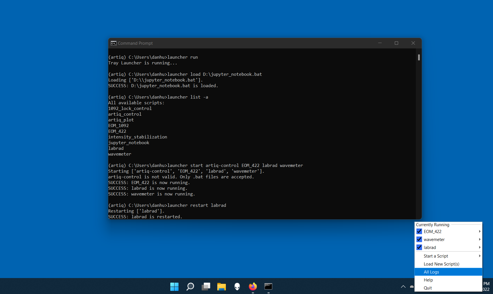

# tray-launcher

A launcher that resides in the Windows taskbar for managing .bat scripts.

## Installation

*tray-launcher* can be installed with `pip install tray-launcher`.

## Usage

*tray launcher* comes with a command-line interface. Use `launcher -h` to learn more.

To get started, run `launcher run`, and a small icon will show on the taskbar.

Before running any scripts from *tray launcher*, they need to be loaded. This can be done by clicking the option **Load New Script(s)** in the context menu. Alternatively, run `launcher load [full path to the script]`. Only *.bat* files are accepted.

To run a script, select it in the **Start a Script** submenu from the context menu, or click **View All** to see all loaded scripts from a file dialogue. Running `launcher start [script name]` will have the same effect.

## Notes

1. *tray launcher* only works on Windows. 

2. *tray launcher* listens to port `127.0.0.1:7686`. If this port is not available, the command line interface will not work. To fix it, create a new environment variable named `TRAY_LAUNCHER_PORT` in the control panel and set its value to an available port number.

3. Loggings of *tray launcher* and all scripts will be saved under `%USERPROFILE%\.tray_launcher\logs`.

4. In case of *tray launcher* crashing, scripts started via the *tray launcher* will NOT be terminated.

5. There is an expected delay when executing "launcher run".

## Screenshots

.png)
.png)
